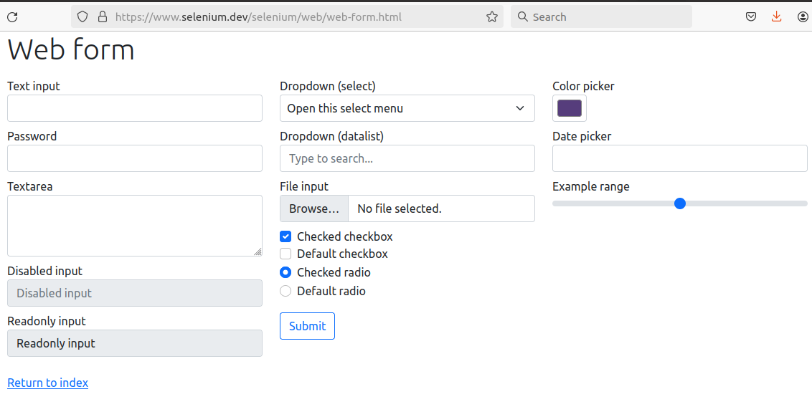

# Instalação e execução do exemplo
- Crie um ambiente virtual (virtual environment) usando a sua versão padrão do Python
```
python3 -m venv venv
```
- Ative o ambiente virtual
```
source venv/bin/activate
```
- Instale os requisitos do projeto
```
pip install -r requirements.txt
```
- Execute o teste de exemplo. Garanta que o Chrome esteja inslado na sua máquina.
```
python -m pytest -k test_selenium.py
```
- Esta página será exibida no browser e os comandos do script serão executados nela



# Referências
- [Selenium WebDriver Documentation](https://www.selenium.dev/documentation/webdriver/)
